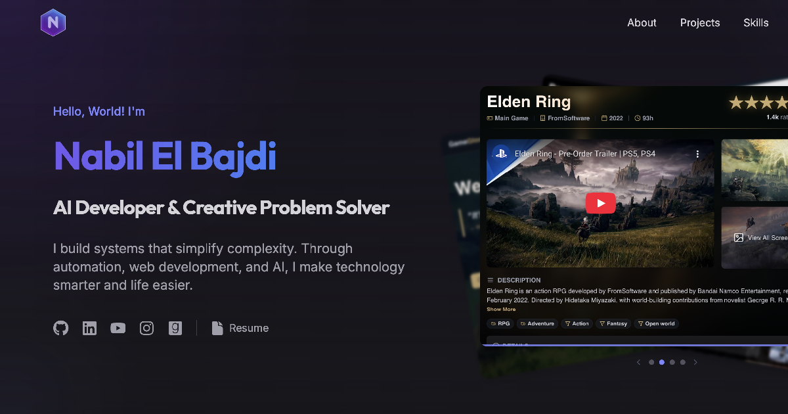

# Nabil El Bajdi — Portfolio

A modern, interactive portfolio showcasing my projects and skills. Built with React 19, featuring two distinct design versions and an interactive terminal interface.



## ✨ Features

- **Dual Versions**: V1 (classic) and V2 (terminal-themed) accessible via routing
- **Interactive Terminal**: Type commands like `help`, `projects`, `skills` in the V2 hero section
- **Command Palette**: Quick navigation with `⌘K` / `Ctrl+K`
- **Time Machine**: Travel between portfolio versions with a creative UI
- **Dark/Light Mode**: Theme toggle with localStorage persistence
- **Responsive Design**: Mobile-first approach with smooth animations
- **Accessibility**: ARIA labels, focus states, and semantic HTML

## 🛠️ Tech Stack

- **Framework**: React 19 + Vite 6
- **Styling**: Tailwind CSS 4
- **Animations**: Framer Motion
- **Routing**: React Router v7
- **Icons**: Lucide React

## 📁 Project Structure

```
src/
├── data/              # Centralized data (projects, skills, social links)
├── components/        # Shared V1 components
├── context/           # Theme provider
├── v1/                # V1 portfolio (classic design)
│   └── V1App.jsx
├── v2/                # V2 portfolio (terminal theme)
│   ├── components/
│   │   ├── layout/    # Header, Footer, PageWrapper
│   │   ├── sections/  # Hero, About, Projects, Skills, Contact
│   │   └── ui/        # Terminal, CommandPalette, BentoGrid
│   ├── context/       # V2-specific theme
│   ├── data/          # Terminal commands, palette commands
│   ├── hooks/         # Custom hooks (useTypewriter)
│   └── styles/        # V2 CSS variables
└── App.jsx            # Root with lazy-loaded routing
```

## 🚀 Getting Started

```bash
# Clone the repository
git clone https://github.com/nabilelbajdi/nabil-portfolio.git
cd nabil-portfolio

# Install dependencies
npm install

# Start development server
npm run dev

# Build for production
npm run build
```

## 🌐 Live Demo

- **V1 (Default)**: [nabilelbajdi.com](https://nabilelbajdi.com)
- **V2 (Terminal)**: [nabilelbajdi.com/v2](https://nabilelbajdi.com/v2)

## 📜 License

MIT © Nabil El Bajdi
